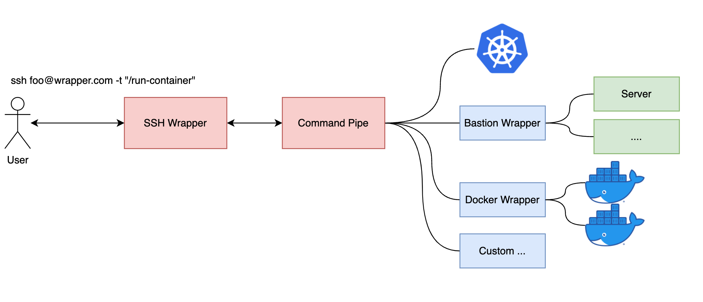

# SSHWrapper - Serving Linux Command via SSH

## Demonstrate

[](https://asciinema.org/a/496099)

## Workflow



## Get Started

### Build

```shell
go build -o ./sshwrapper cmd/sshwrapper.go
```

```shell
$ ./sshwrapper -h
Usage of ./sshwrapper:
  -config string
    	sshwrapper config file (default "./example.yaml")
  -listen-addr string
    	sshwrapper listen address (default "0.0.0.0:2022")
```

## Examples

### Container Auto Provision

Please make sure docker is installed and started

**example.yaml**

```yaml
routes:
  - uri: "/run-container"
    allow:
      - anyisalin
    handler:
      command:
        cmd: "/bin/bash"
        args:
          - -c
          - docker run --name container-$SSHWRAPPER_USERNAME --hostname=$SSHWRAPPER_USERNAME -ti --rm ubuntu:20.04 /bin/bash
```

**Serving and Testing**

```shell
./sshwrapper --config ./example.yaml
```

```shell
SERVER_ADDR="<your_wrapper_server>:2022"
ssh anyisalin@$SERVER_ADDR "/run-container"
```

### Kubernetes Watchtower

Please make sure k9s command line is installed

**example.yaml**

```yaml
routes:
  - uri: "/kube-watchtower"
    allow:
      - anyisalin
    handler:
      command:
        cmd: "k9s"
  users:
    - name: anyisalin
      password: 123456
```

**Serving and Testing**

```shell
./sshwrapper --config ./example.yaml
```

```shell
SERVER_ADDR="<your_wrapper_server>:2022"
ssh anyisalin@$SERVER_ADDR "/k8s-watchtower"
```